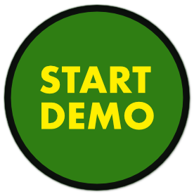

# Start Demo - VS Code Extension

Configure your demo settings ahead and get into demo mode instantly when required.

TODO: Animation

## Extension Settings

This extension contributes the following settings:

- `startDemo.zoomLevel`: set zoom level
- `startDemo.enableZenMode`: enable / disabe Zen mode

## Known Issues

- nothing yet

## Release Notes

### 1.0.0

Initial release of Start Demo

---

**Enjoy!**
